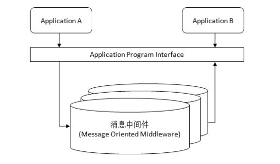

# Kafka

### 简介

Apache Kafka是一个开源消息系统，由Scala写成。是由Apache软件基金会开发的一个开源的分布式消息队列。

Kafka最初是由LinkedIn公司开发，并于2011年初开源。2012年10月从Apache Incubator毕业。该项目的目标是为处理实时数据提供一个统一、高通量、低等待的平台。

### 工作原理

Kafka适用于需要可靠的数据传送的分布式环境。不同的应用程序之间并不直接关联，而是通过消息中间件提供的应用程序接口协同工作。

1、应用程序A完成任务后发送消息给消息中间件

2、在合适的时候，消息中间件将应用程序A发送过来的消息传递给应用程序B

3、应用程序B接收到消息中间件发来的应用程序A的消息，开始下一步操作，并把结果发送给消息中间件

### Kafka的用途

#### 解耦：

在项目启动之初来预测将来会碰到什么需求是极其困难的。消息中间件在处理过程中间插入了一个隐含的、基于数据的接口层，两边的处理过程都要实现这一接口，这允许你独立地扩展或修改两边的处理过程，只要确保它们遵守同样的接口约束即可。

#### 冗余（存储）：

有些情况下，处理数据的过程会失败。消息中间件可以把数据进行持久化直到它们已经被完全处理，通过这一方式规避了数据丢失风险。在把一个消息从消息中间件中删除之前，需要你的处理系统明确地指出该消息已经被处理完成，从而确保你的数据被安全地保存直到你使用完毕。

### Kafka相关术语

-   broker：在 Kafka 集群中，每台 Kafka 服务器主机都是一个broker

-   Producer：生产者，发布消息的对象

-   Consumer：消费者，订阅消息并处理发布的消息的对象

-   Consumer Group：消费者群组，Kafka 架构中，消费者总是以消费者群组存在

-   Topic：主题，Kafka 将消息以Topic的方式分类存储在 log 文件当中

-   partition：分区，Kafka可以将消息平均划分送由分区存储，分区越多，并行读写越快，实现负载均衡。Kafka 还将分区内的消息存储在不同 broker 的follow 副本中，从而实现高可用，每个 Topic 包含一个或多个 Partition

-   base offset：基础偏移量，第一条消息的起始位置

-   LEO：日志文件最后偏移，下一条消息的起始偏移位置

-   HW：消费者可消费的消息偏移位置

-   rebalance：再平衡，

-   segment：日志分段，Kafka 的日志文件采用分段存储，分段规则可以是时间也可以是文件大小

-   leader：生产者发送的每条消息都会有一个消息 leader，只有它负责与消费者交互

-   follower：

-   Replication：副本，消息备份